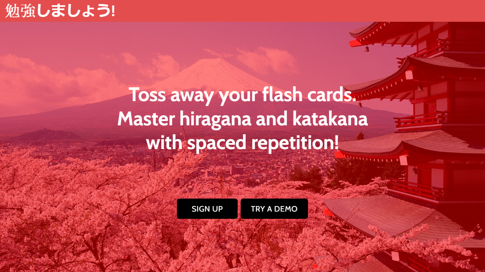
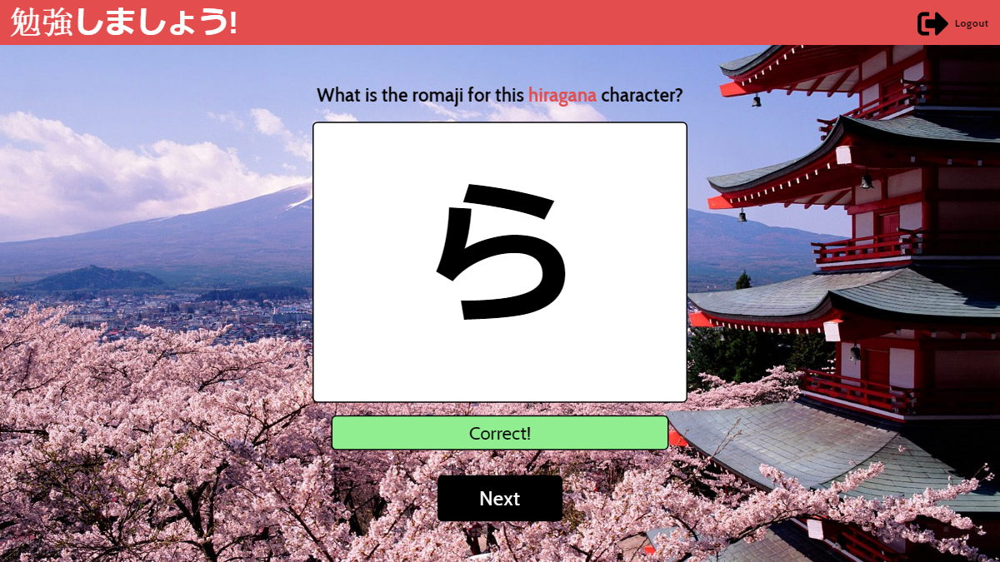

<h1> Benkyoushimashou! </h1>

  	<b>Benkyoushimashou!</b> helps first year students of Japanese learn hiragana and katakana with spaced repetition.

  	
  	
<h2>Start learning hiragana and katakana</h2>
<b>Benkyoushimashou!</b> is deployed on <a href="https://benkyoushimashou.netlify.com/">Netlify</a>. 
 

<h2>Tech stack</h2>
<h3> Front end</h3>
<ul>
  	<li>React</li>
  	<li>Redux</li> 
</ul>

<h3>Back end</h3>
<ul>
  	<li>Node.js</li>
  	<li>Express</li>
  	<li>Redis</li> 
</ul>

<h2>Back end repository</h3>

The repository for the back end can be found <a href="https://github.com/continuouslylearning/benkyoushimashou/">here</a>.

